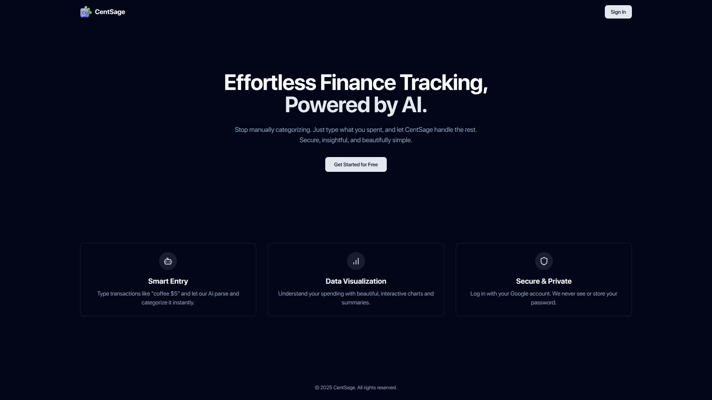
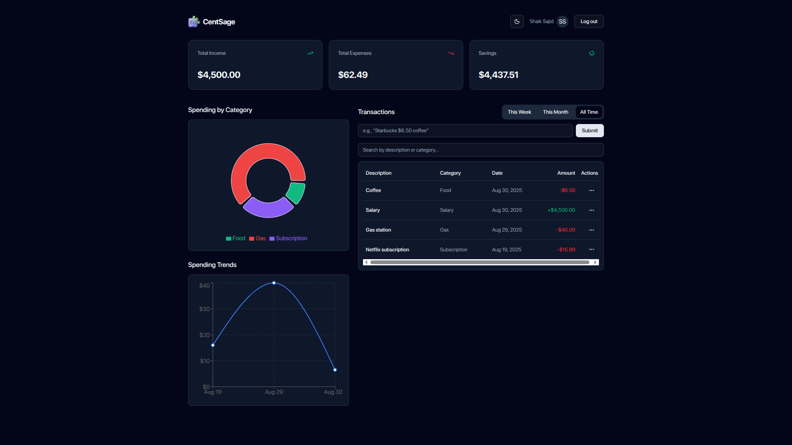
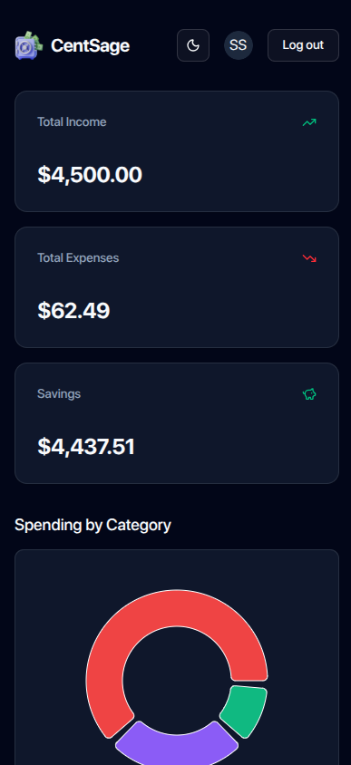

# 💰 CentSage - AI-Powered Finance Tracker

CentSage is an intelligent finance tracker that allows users to manage their transactions using **natural language**.  
It features **secure Google OAuth authentication**, **AI-powered transaction parsing** (via OpenRouter), and a **responsive dashboard** with data visualizations to provide clear financial insights.

---

## 📸 Screenshots

- **Landing Page**  
  

- **Desktop Dashboard**  
  

- **Mobile View**  
  

---

## ✨ Features

- 🔑 **Secure Google OAuth** – Secure sign-in and sign-up using Google accounts. No passwords needed.
- 🤖 **AI-Powered Smart Entry** – Enter transactions in plain English (e.g., `"Coffee at Starbucks $5.50"`).
- 📊 **Dynamic Dashboard** – View real-time summaries of income, expenses, and savings.
- 📈 **Data Visualizations** – Interactive pie and line charts to understand spending habits.
- 📝 **Full CRUD Functionality** – Create, read, update, and delete transactions through a polished UI.
- 🔄 **Live Data Refresh** – The dashboard automatically updates after any transaction change.
- 🔍 **Search & Filtering** – Instantly filter the transaction list by description or category.
- ⏳ **Time-Based Filtering** – View analytics for "This Week," "This Month," or "All Time."
- 🎨 **Polished UX** – Landing page, 404 page, confirmation dialogs, and toast notifications.
- 📱 **Responsive Design** – Works seamlessly across desktop and mobile devices.
- 🌗 **Dark/Light Mode** – Theme toggle for user preference.

---

## 🛠️ Tech Stack

### **Backend**

- Framework: **Node.js**, **Express**
- Database: **MongoDB (Mongoose)**
- Authentication: **Passport.js (Google OAuth 2.0)**, **JWT**
- AI: **OpenRouter API (gemma-3n-e4b-it:free)**
- Language: **TypeScript**

### **Frontend**

- Framework: **React (Vite)**
- Language: **TypeScript**
- Styling: **Tailwind CSS v4**
- UI Components: **shadcn**
- State Management: **React Context API**
- Data Fetching: **Axios**
- Charting: **Recharts**
- Notifications: **Sonner**

---

## ⚙️ Getting Started: Local Setup

Follow these steps to run CentSage locally.

### ✅ Prerequisites

You must have installed:

- [Node.js](https://nodejs.org/) (v18+)
- npm
- Git

---

### 1. Clone the Repository

```bash
git clone https://github.com/sazcs/centsage.git
cd centsage
```

---

### 2. Backend Setup

**Install Dependencies**

```bash
cd backend
npm install
```

**Environment Variables**
Create a `.env` file in the `/backend` directory:

```bash
cp .env.example .env
```

Fill in the following keys:

- **MONGO_URI**

  - Create a free [MongoDB Atlas](https://www.mongodb.com/atlas) account.
  - Create a new project and free M0 cluster.
  - Create a database user & password under **Database Access**.
  - Add your IP (or `0.0.0.0/0` for dev) under **Network Access**.
  - In **Clusters > Connect > Drivers**, copy your connection string (replace `<password>`).

- **GOOGLE_CLIENT_ID & GOOGLE_CLIENT_SECRET**

  - Go to [Google Cloud Console](https://console.cloud.google.com/).
  - Create a project → APIs & Services → OAuth consent screen → select _External_.
  - Create OAuth credentials → Web Application.
  - Add Redirect URI: `http://localhost:5001/api/auth/google/callback`.
  - Copy **Client ID** and **Client Secret**.

- **OPENROUTER_API_KEY**

  - Go to [OpenRouter.ai](https://openrouter.ai/google/gemma-3n-e4b-it:free).
  - Sign up or log in, generate an API key.

- **JWT_SECRET**
  - Generate a strong random string (≥32 chars).

---

### 3. Frontend Setup

**Install Dependencies**

```bash
cd ../frontend
npm install
```

**Environment Variables**
Create `.env` in `/frontend`:

```bash
cp .env.example .env
```

Fill in:

```env
VITE_GOOGLE_CLIENT_ID=YOUR_GOOGLE_CLIENT_ID
```

Use the same Client ID as backend.

---

### 4. Running the Application

Open **two terminals**:

**Backend**

```bash
cd backend
npm run dev
```

Runs at 👉 [http://localhost:5001](http://localhost:5001)

**Frontend**

```bash
cd frontend
npm run dev
```

Runs at 👉 [http://localhost:5173](http://localhost:5173)
